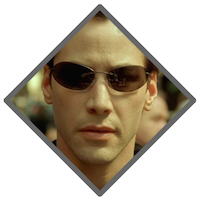
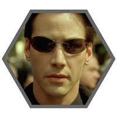
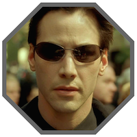
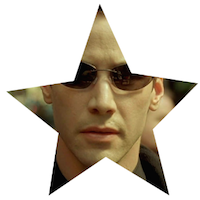

# Shape Image View 
[](https://travis-ci.org/siyamed/android-shape-imageview/) 
[](https://maven-badges.herokuapp.com/maven-central/com.github.siyamed/android-shape-imageview)

Provides a set of custom shaped android imageview components, and a framework to define more shapes. Implements both **shader** and **bitmap mask** based image views. 

[Shader]: http://developer.android.com/reference/android/graphics/BitmapShader.html
[Path.addPath]: http://developer.android.com/reference/android/graphics/Path.html#addPath(android.graphics.Path)
[Path]: http://developer.android.com/reference/android/graphics/Path.html
[xfermode]: http://developer.android.com/reference/android/graphics/Xfermode.html
[svg_location]: library/src/main/res/raw
[svg_rectangle]: http://www.w3schools.com/svg/svg_rect.asp 
[svg_circle]: http://www.w3schools.com/svg/svg_circle.asp 
[svg_ellipse]: http://www.w3schools.com/svg/svg_ellipse.asp
[svg_polygon]: http://www.w3schools.com/svg/svg_polygon.asp
[svg_path]: http://www.w3schools.com/svg/svg_path.asp
[svg_group]: https://developer.mozilla.org/en-US/docs/Web/SVG/Element/g
[svg_transformations]: https://developer.mozilla.org/en-US/docs/Web/SVG/Attribute/transform
[sample_app_play_store]: https://play.google.com/store/apps/details?id=com.github.siyamed.shapeimageview.sample
[youtube_video]: http://youtu.be/6fCkptmwxtQ

* [Shader][Shader] based one uses *canvas draw methods* and *[Path][Path]* class, 
* Mask based one uses [xfermode][xfermode] to draw image on bitmaps defined by android shape XML's or resource bitmaps.

<div>
<a href="images/shader-buble.png" style="float:left;">

</a>
<a href="images/all-samples.png" >

</a>
</div>

There are many projects online implementing such components, however one goal of this project is to provide a 
performant/smooth scrolling **image view component framework** to define different shapes for imageviews. 

**For use with recycling view such as ListView or GridView please use shader based implementations.**

[Sample app in play store][sample_app_play_store]

[Youtube video][youtube_video]

## How to use

Gradle dependency:
```Groovy
compile 'com.github.siyamed:android-shape-imageview:0.9.+@aar'
```

###Shader Based ImageView's
####BubbleImageView

```XML
<com.github.siyamed.shapeimageview.BubbleImageView
    android:layout_width="match_parent"
    android:layout_height="match_parent"
    android:src="@drawable/neo"
    app:siArrowPosition="right"
    app:siSquare="true"/>
```

Attributes:
* `siTriangleHeight` the height of the bubble pointer in dp
* `siArrowPosition` where to point the arrow, currently `left|right`
* `siSquare` set width and height to the minimum of the given values `true|false`

####RoundedImageView

```XML
<com.github.siyamed.shapeimageview.RoundedImageView
    android:layout_width="match_parent"
    android:layout_height="match_parent"
    android:src="@drawable/neo"
    app:siRadius="6dp"
    app:siBorderWidth="6dp"
    app:siBorderColor="@color/darkgray"
    app:siSquare="true"/>
```

Attributes:
* `siBorderColor` border color
* `siBorderWidth` border width in dp
* `siBorderAlpha` alpha value of the border between 0.0-1.0
* `siRadius` corner radius in dp
* `siSquare` set width and height to the minimum of the given values `true|false`

####CircularImageView

```XML
<com.github.siyamed.shapeimageview.CircularImageView
    android:layout_width="match_parent"
    android:layout_height="match_parent"
    android:src="@drawable/neo"
    app:siBorderWidth="6dp"
    app:siBorderColor="@color/darkgray"/>
```

Attributes:
* `siBorderColor` border color
* `siBorderWidth` border width in dp
* `siBorderAlpha` alpha value of the border between 0.0-1.0

####ShapeImageView
This view has the capability to process a provided SVG file (for a limited set of SVG elements), build a 
[Path][Path] object and draw it on the shader. The library includes SVG files defining a set of basic shapes and 
ShapeImageView subclasses using those files. You can use whatever SVG you want to have a wonderful 
and creatively shaped images in your application. The included SVG files are under [library/src/main/res/raw][svg_location]


| DiamondImageView                                       | PentagonImageView                                        | HexagonImageView                                         |
| ------------------------------------------------------ | -------------------------------------------------------- | -------------------------------------------------------- |
|  |  |    |


| OctogonImageView                                       | StarImageView                                            | HeartImageView                                       |
| ------------------------------------------------------ | -------------------------------------------------------- | ---------------------------------------------------- |
|  |         |    |


```XML
<com.github.siyamed.shapeimageview.{ClassName}
    android:layout_width="match_parent"
    android:layout_height="match_parent"
    android:layout_margin="8dp"
    android:src="@drawable/neo"
    app:siBorderWidth="8dp"
    app:siBorderColor="@color/darkgray"/>
```

Attributes:
* `siBorderColor` border color
* `siBorderWidth` border width in dp
* `siBorderAlpha` alpha value of the border between 0.0-1.0
* `siStrokeCap` border stroke cap type `butt|round|square`
* `siStrokeJoin` border stroke join type `bevel|miter|round`
* `siSquare` set width and height to the minimum of the given values `true|false`
* `siShape` a reference to an SVG. This is used by ShapeImageView, not the subclasses of it.


SVG elements that are supported are: [rectangle][svg_rectangle], [circle][svg_circle], 
[ellipse][svg_ellipse], [polygon][svg_polygon], [path][svg_path], [group][svg_group]. [Transformations][svg_transformations] on those elements are also supported. 

The system converts an SVG file into a Path. For each element including the parent element `<svg>` a new Path is created, and all the children Path's are [added][Path.addPath] to their parent path. 

###Bitmap Mask Based ImageViews 

This view uses extra bitmaps for bitmap masks. Therefore it would be good to use them for very custom shapes, 
possibly not in a recycling view. 

* With [mask bitmap](sample/src/main/res/drawable/star.png): 


```XML
<com.github.siyamed.shapeimageview.shape.PorterShapeImageView
    android:layout_width="match_parent"
    android:layout_height="match_parent"
    app:siShape="@drawable/star"
    android:src="@drawable/neo"
    app:siSquare="true"/>
```

* With [shape XML](sample/src/main/res/drawable/shape_rounded_rectangle.xml):


```XML
<com.github.siyamed.shapeimageview.shape.PorterShapeImageView
    android:layout_width="match_parent"
    android:layout_height="match_parent"
    app:siShape="@drawable/shape_rounded_rectangle"
    android:src="@drawable/neo"
    app:siSquare="true"/>
```

rounded rectangle shape definition in XML: 

```XML
<shape android:shape="rectangle" xmlns:android="http://schemas.android.com/apk/res/android">
    <corners
        android:topLeftRadius="18dp"
        android:topRightRadius="18dp"
        android:bottomLeftRadius="18dp"
        android:bottomRightRadius="18dp" />
    <solid android:color="@color/black" />
</shape>
```

Attributes:
* `siShape` the bitmap mask shape, either a shape drawable or a bitmap
* `siSquare` set width and height to the minimum of the given values `true|false`

This method reads a shape file (either bitmap or an android shape xml), creates a bitmap object using this shape, and finally combines the bitmap of the real image to be shown and the mast bitmap using xfermode. 

## Sample

See/execute the [sample](sample) for a demonstration of the components.

If you are lazy check [this youtube video][youtube_video] demonstrating scrolling in the sample app

You can download the [sample app from play store][sample_app_play_store] 

## References
* [MostafaGazar/CustomShapeImageView](https://github.com/MostafaGazar/CustomShapeImageView): Used this project a basis for bitmap masks  
* [geosolutions-it/mapsforge/svg-android](https://github.com/geosolutions-it/mapsforge/tree/master/svg-android): Used and modified to create a path from a svg file 

[](https://android-arsenal.com/details/1/932)
